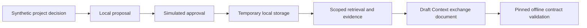

# Context Ontology Companion: architecture and roadmap

The `demo` uses synthetic examples, temporary storage, and simulated approval. A separate local prototype now implements persistent local storage, authenticated loopback human review, and manually configured stdio. Local synthetic tests have passed; real-data use, production authentication, and actual ChatGPT/Codex host integration remain unsupported.

This P1a slice tests a real local consumer of the draft contract. Simulated approval exercises plumbing only; it must never accept real conversation records as though a trusted user had authorized storage. A production approval channel must bind an authenticated user, scope, action, revision, payload, and expiry outside model-generated text.

The separate local prototype now implements prepared changes, authenticated human review, persistent local storage, scoped retrieval, supersession, withdrawal, erasure, history, and current-context export. Its local stdio adapter requires explicit manual configuration. These implemented local features remain synthetic-only; actual host integration and real-data use are unsupported. [Local runtime and trust boundaries](LOCAL_RUNTIME.md). The wider product roadmap extends those workflows toward a separately validated service. Those broader requirements remain in the [design index](INDEX.md). The current preview does not promise complete retrieval, production erasure, historical `known_at` reconstruction, or improved task outcomes. Equal-budget task-resumption evaluation against a simple Markdown/JSON baseline remains required.

## Independent products

Contract artifacts provide a versioned interchange boundary. Code, Context, and Contracts remain separate installation and permission domains. A consumer pins or vendors the tested artifact; it need not install the Contracts plugin. Sharing schemas does not grant database access, permission inheritance, automatic tool routing, or a platform dependency mechanism.

The existing Code product is a read-only reference during this work. Its public documentation structure was checked at revision `be1699f784e48433a692bbfaa1c6c1d6f2b489b0` on 2026-09-05. [Code Ontology Companion](https://github.com/battle-doll/code-ontology-companion) was not modified.

## Release path

| Stage | Required evidence |
| --- | --- |
| P0 | Actual repository, platform, permission and host baseline |
| P1a | Draft contracts exercised by synthetic Code mapping and Context consumer |
| P1b | Versioned artifacts and explicit compatibility fixtures |
| P2 | Product workflow and independent-installation checks |
| P3 | Each advertised OS and actual host tested; submission and publication tracked separately |
| P4 | Optional Code bridge with separately authorized changes if needed |
| P5 | Shared pure execution code only after two consumers demonstrate reuse |

The target OS family is macOS, Windows, and Linux. Consult [platform evidence](PLATFORMS.md), [versioning](VERSION_POLICY.md), and [release/rollback policy](RELEASE_POLICY.md). A configured CI matrix is not proof that its jobs ran.
